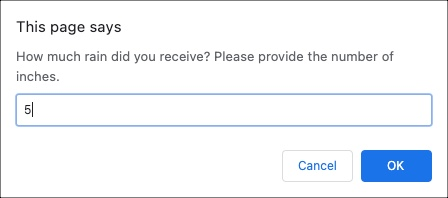
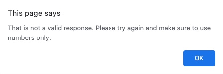
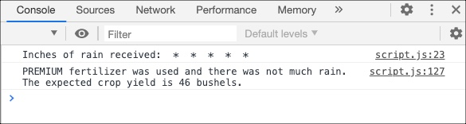

# Carnaghi-Part-Two

## Table of Contents

- [Description](#description)
- [Technologies Used](#technologies-used)
- [Link to Demo Video & Screenshots](#link-to-demo-video-&-screenshots)

## Description

Deliverable 2 for Grand Circus Front-End Coding Bootcamp: A JavaScript program that prompts a user for the amount of rain received, whether or not they used fertilizer and the type of fertizlier used. This information is then used to calculate how much grain an acre of land produces (called the "yield").

## Technologies Used

- HTML
- JavaScript

## Link to Demo Video & Screenshots

  

